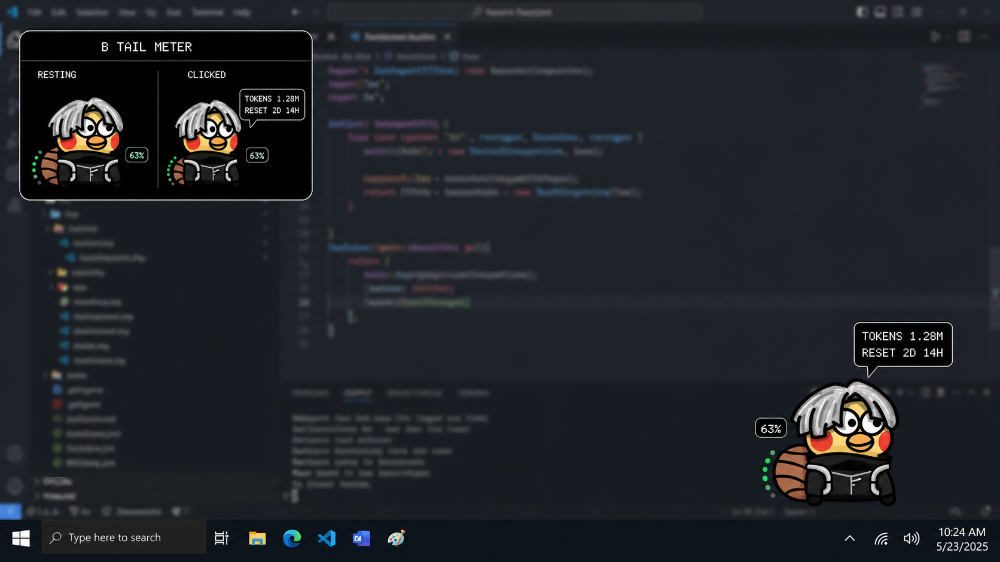

# Codex Usage Pet

一个仅适用于 Windows 的小型 Codex 桌面宠物，用尾巴圆点和百分比直观展示当前 **5 小时窗口的剩余额度**。点击宠物还能查看 5 小时与每周剩余额度、重置倒计时，以及作为次要信息展示的 token 活动。



## 安装

在终端中依次运行：

```powershell
codex plugin marketplace add kk6763/codex-usage-pet
codex plugin add codex-usage-pet@codex-usage-pet-marketplace
```

安装完成后，在 Codex 中新建一个任务，然后输入：

```text
启动用量宠物
```

以后需要手动显示时，在任意 Codex 新任务中再次输入“启动用量宠物”即可。

## 自动启动与关闭

启用“打开 Codex 时自动启动宠物”：

```text
打开 Codex 时自动启动用量宠物
```

取消自动启动：

```text
取消用量宠物自动启动
```

手动退出宠物：

```text
退出用量宠物
```

启用自动启动后，本地轻量监听器会在 Codex 桌面应用打开时显示宠物，并在 Codex 退出后关闭宠物。宠物会保存并恢复上次的位置和大小。

## 使用方式

- 徽章与 7 个尾巴圆点显示当前 5 小时窗口的剩余百分比。
- 点击宠物查看详细额度、重置倒计时和 token 活动。
- 拖动宠物可改变位置。
- 右键可打开本地菜单。
- 按住 `Ctrl` 并滚动鼠标滚轮可调节大小。

## 隐私

宠物只在本机读取 Codex 已认证的 app-server 所提供的额度信息；备用读取仅使用本地会话 JSONL 中的数值 `token_count` 字段。它不会读取、复制、打印或上传 `auth.json`，也不会上传提示词、回复、文件内容或工具输出。仓库中不包含任何用户凭据或个人用量记录。

## 系统要求

- Windows 10 或 Windows 11
- Codex 桌面应用
